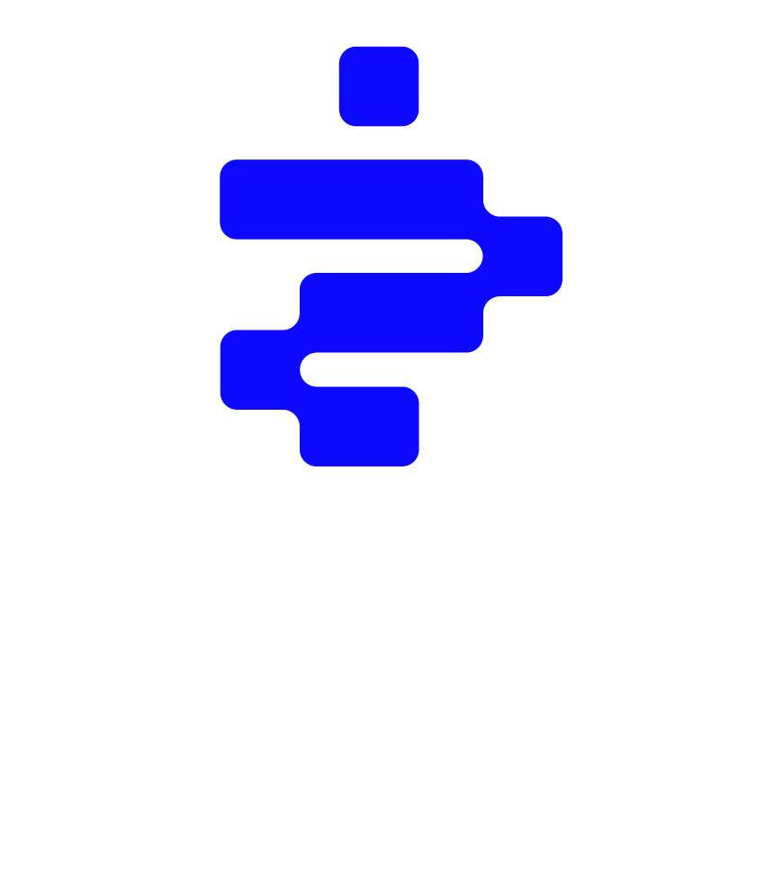
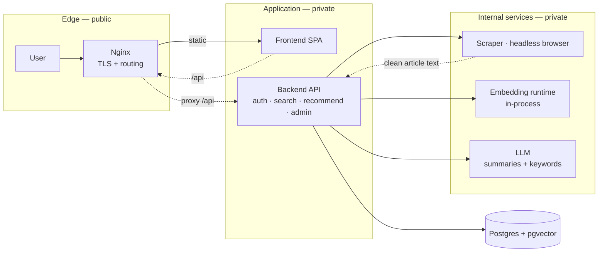
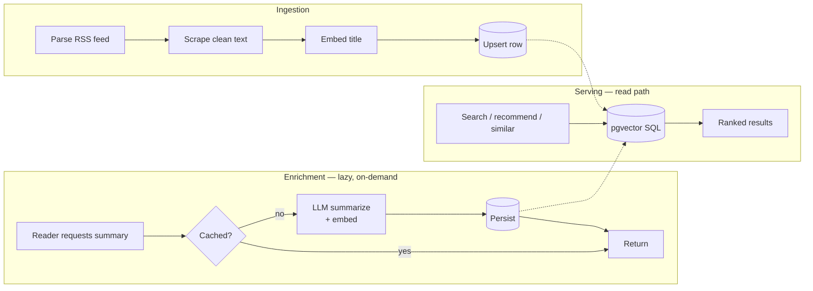
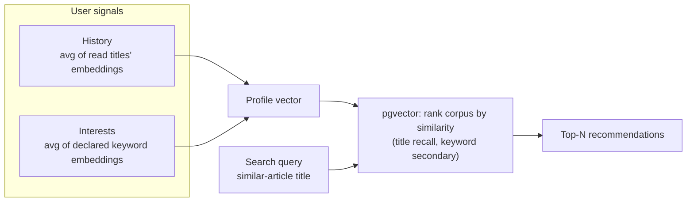

  

# Khulasa — خلاصة

A news aggregation, summarization, and personalized recommendation platform, built for a startup and deployed to production. It pulls articles from RSS feeds, extracts and stores their content, generates AI summaries on demand, and recommends articles to each reader based on their reading history and declared interests, all backed by semantic vector search.

**Stack:** FastAPI · SQLAlchemy · PostgreSQL + pgvector · React + Vite · Docker · Nginx · OpenAI-compatible LLM · headless-browser scraper

---

## Why

Most news readers re-rank a single global feed. Khulasa builds a *per-user* model of interest from two signals, what someone reads and what they say they care about, and retrieves from a vector index of every ingested article.

The design goals were to embed cheaply, keep scraping out of the request path, make recommendations that go beyond title similarity, and keep the whole system cheap enough to run on a single host.

---

## What it does

- **Aggregates** articles from configured RSS sources into a PostgreSQL store with native vector columns.
- **Embeds** every article title in-process, with no external API call, for semantic retrieval.
- **Summarizes** an article with an OpenAI-compatible LLM the first time any user asks, then serves the cached summary to everyone afterward.
- **Searches** by natural-language query using vector similarity over title embeddings, not keyword matching.
- **Recommends** by combining a user's history and interest embeddings into a profile vector, then ranking the corpus against it.
- **Surfaces related articles** by finding the most semantically similar ones for any article.
- **Remembers** bookmarks and read history, scoped per user.
- **Evolves with the reader:** declared topics refine the profile vector over time, and cold-start users can shape recommendations before any history exists.
- **Supports administration:** admins add sources, trigger scrapes, and promote other admins.

---

## Architecture

Khulasa is a set of small, single-purpose containerized services on a private network. Each owns one concern and can be scaled independently.

| Component | Role |
| --- | --- |
| **Edge (Nginx)** | Terminates TLS, serves the SPA, reverse-proxies API traffic. Owns security headers and HSTS. |
| **Frontend** | Single-page application consuming the REST API. React + Vite, shipped as static assets. |
| **Backend API** | The domain core: authentication, article and source management, search, recommendations, bookmarks and history, admin orchestration. FastAPI + SQLAlchemy, with Pydantic-validated requests and a migration-managed schema. |
| **Scraper** | Isolated service that drives a headless browser, extracts readable article content, and returns cleaned text. Kept separate because browser automation crashes, leaks memory, and should be sandboxed away from the API. |
| **Embedding runtime** | Serves embedding and reranker models over HTTP. Used for title embedding at ingest and similarity search at query time. |
| **LLM** | Any OpenAI-compatible endpoint. Produces summaries and keyword tags per article. |
| **Store (Postgres + pgvector)** | System of record: articles, sources, users, history, bookmarks, and the vector columns that make semantic search a single SQL expression. |

### Data lifecycle

Khulasa separates three phases that naive aggregators often conflate:

1. **Ingestion:** An admin points the system at an RSS feed. The feed is parsed, each entry is scraped to clean text, the title is embedded, and the row is upserted.
2. **Enrichment:** A lazy, on-demand path. When a reader requests a summary, the article is summarized by the LLM, its keywords are extracted and embedded, and the results are cached. The process is idempotent and shared across all users, so the cost of a summary is paid once, ever.
3. **Serving:** Read-heavy, stateless, and cacheable. Search, similar articles, recommendations, bookmarks, and history all reduce to pgvector queries and reads.

Expensive, stateful work (scraping, summarizing, embedding) stays out of the read path. The read path is just SQL.

### Summarization

Summarization is a single endpoint, `POST /articles/summarize`. The first request pays the full cost (scrape, summarize, embed) and stores the result. Every later request for that article, from any user, is a cache hit.

### Recommendation

A recommendation ranks the corpus by similarity to a *user profile vector*, not a single query vector. The profile blends two signals:

- **History:** the average of title embeddings of articles the user has read.
- **Interests:** the average of keyword embeddings of topics the user has declared.

The profile vector is compared against every article (title embedding for recall, keyword embeddings as a secondary signal), and the top results are returned. The same primitive, comparing a query vector to the corpus, powers natural-language search and related articles. Only the source of the query vector changes.

### Authentication

JWT-based, with separate short-lived access tokens and longer-lived refresh tokens, salted password hashing, and per-user role flags driving admin-only endpoints.

---

## Deployment

Khulasa runs in production on a Linux VPS. All services run as Docker containers composed together, behind Nginx with automatic TLS (certificates renew and reload without downtime). Storage lives on a persistent volume, the services share a private network, and only the edge exposes ports.

The composition is deliberately flat, with no orchestrator, so the system stays understandable end to end. The service boundaries are drawn so that moving to an orchestrator later would be a relocation, not a redesign.

---

## Roadmap

- Scheduled ingestion worker (currently admin-triggered)
- Two-stage retrieval: pgvector recall followed by cross-encoder reranking, reusing the existing embedding runtime

---

## Source code

Khulasa was developed for a startup, so the source code is not public. This document describes the system's design and behavior.
