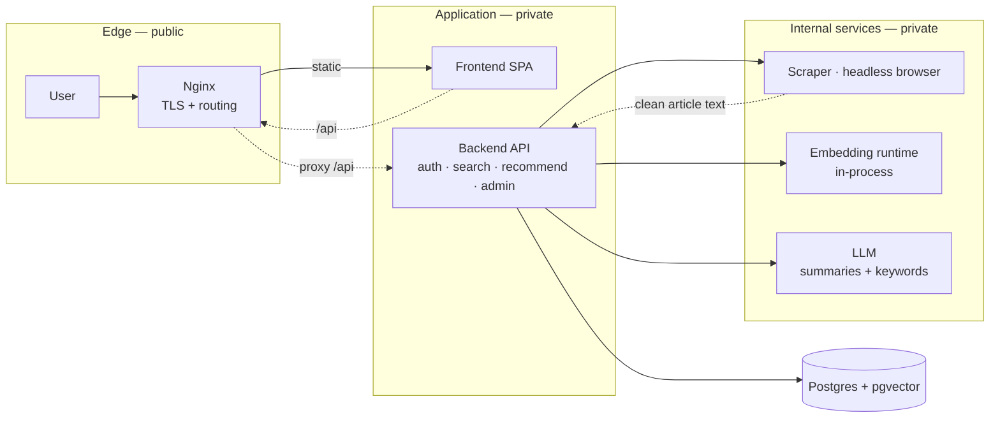
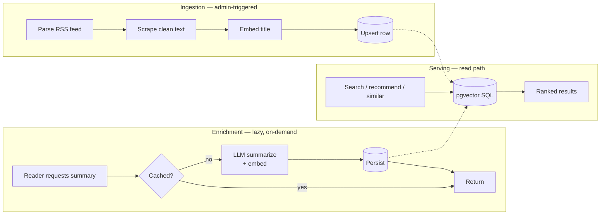
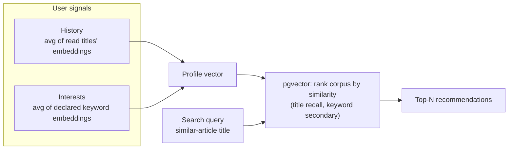

# Khulasa

**خلاصة** — *summary*

Khulasa is a news aggregation, summarization, and personalized recommendation
platform. It pulls articles from RSS feeds, extracts and stores their content,
generates AI summaries on demand, and recommends pieces to each reader based on
their reading history and declared interests — all backed by semantic vector
search.

The project is a study in assembling an ML-flavored backend from off-the-shelf
parts: a vector database, an on-device embedding runtime, an LLM for
summarization, a headless-browser scraper, and a single-page frontend — composed
into one deployable system.

---

## Why

Most news readers re-rank a single global feed. Khulasa instead builds a
*per-user* model of interest from two signals — what someone reads and what
someone says they care about — and retrieves from a vector index of every
ingested article. The interesting design questions live at the seams: how to
embed cheaply, how to keep scraping out of the request path, how to make a
"recommendation" that is more than title-similarity, and how to keep the whole
thing cheap enough to run on one host.

---

## What it does

- **Aggregates** articles from configured RSS sources into a PostgreSQL store
  with native vector columns.
- **Embeds** every article title in-process (no external API call)
  for semantic retrieval.
- **Summarizes** an article with an OpenAI-compatible LLM the first time a user
  asks, then serves the cached summary afterward.
- **Searches** by natural-language query — vector similarity over title
  embeddings, not keyword matching.
- **Recommends** by combining a user's history and interest embeddings to form a
  profile vector, then ranking the corpus against it.
- **Discovers relations** — for any article, surfaces the most semantically
  similar others.
- **Remembers** — bookmarks and read history, scoped per user.
- **Lets interests evolve** — users register topics; these refine the profile
  vector over time.
- **Delegates administration** — admins add sources, trigger scrapes, and
  promote other admins.

---

## Architecture

Khulasa is a set of small, single-purpose services that talk over a private
network. Each owns one concern and can be reasoned about (and later scaled)
independently.

### Components and responsibilities

| Component | Role |
|---|---|
| **Edge (Nginx)** | Terminates TLS, serves the SPA, reverse-proxies API traffic. Owns security headers and HSTS. |
| **Frontend** | A single-page application that consumes the REST API. React + Vite, shipped as static assets. |
| **Backend API** | The domain core: authentication, article/source CRUD, search, recommendations, bookmarking and history, admin orchestration. Built on FastAPI + SQLAlchemy, with Pydantic-validated requests and a migration-managed schema. |
| **Scraper** | An isolated service that drives a headless browser, extracts the readable article content, and returns cleaned text. Kept separate because browser automation belongs in its own process — it crashes, leaks, and must be sandboxed away from the API. |
| **Embedding runtime** | Serves embedding **and** reranker models over HTTP. Used for title embedding at ingest and similarity search at query time. |
| **LLM** | Any OpenAI-compatible endpoint. Produces summaries and, in the enrichment path, keyword tags per article. |
| **Store (Postgres + pgvector)** | The system of record. Articles, sources, users, history, bookmarks, and the vector columns that make semantic search a single SQL expression. |

### The data lifecycle

Khulasa separates three phases that are often conflated in naive aggregators:

1. **Ingestion** — an admin points the system at an RSS feed. The feed is
   parsed, each entry is scraped to clean article text via the headless-browser
   service, the title is embedded, and the row is upserted. Today this is
   admin-triggered; the design intent is to move it to a scheduled worker.
2. **Enrichment** — a lazy, on-demand path. When a reader requests a summary,
   the article is summarized by the LLM, its keywords are extracted and
   embedded, and the results are cached. Subsequent requests are free. The
   enrichment is idempotent and shared across all users: the cost of a summary
   is paid once, ever.
3. **Serving** — read-heavy, stateless, cacheable. Search, similar-articles,
   recommendations, bookmarks and history all reduce to pgvector queries and
   reads.

The key architectural consequence: the expensive, stateful work (scraping,
summarizing, embedding) is pushed **out** of the read path. The read path is
just SQL.

### On-demand summarization

The enrichment phase is a single endpoint, `POST /articles/summarize`. Its first
invocation pays the full cost — scrape, LLM summarize, embed — and stores the
result; every later request for that article, by any user, is a cache hit.

### How recommendation works

A recommendation is a ranking of the corpus by similarity to a *user profile
vector*, not a single query vector. The profile is a blend of two signals:

- **History** — the average of title embeddings of the articles a user has read.
- **Interests** — the average of keyword embeddings of topics a user has
  declared.

The profile vector is compared against every article (title embedding for
recall, keyword embeddings as a secondary signal), and the top results are
returned. This is why interests are first-class — they let a cold-start user
influence their profile before any history exists.

The same primitive — compare a query vector to the corpus — underwrites
natural-language search and similar-articles. The only thing that varies is the
source of the query vector.

### Toward two-stage retrieval

The current ranking is single-stage vector similarity. The intended next step is
**recall then rerank**: pgvector returns a broad candidate set by vector
distance, and a cross-encoder model scores the candidates more precisely. This
turns "reranked by relevance" from an aspiration into a real second pass, and
reuses the existing embedding runtime (which already serves multiple models).

### Authentication

JWT-based, with separate short-lived access tokens and longer-lived refresh
tokens, salted password hashing, and per-user role flags driving admin-only
endpoints.

---

## Deployment

Everything runs as containers on one host, composed together. Storage is on a
persistent volume; TLS is automatic, with certificates renewed and reloaded
without downtime. The services share a private network; only the edge exposes
ports.

The composition is deliberately flat — no orchestrator — because the goal is a
system that is understandable end to end. The boundaries are drawn so that
moving to an orchestrator later is a relocation, not a redesign.
